# Pattern Syntax

* [Pitches](#pitches)
* [Rhythm](#rhythm)
* [Chords](#chords)
* [Octave Transposition](#octave)
* [Alterations](#alterations)

## Pitches
Pitches represented by hex numbers.
From `0` to `f` they are the step numbers of a chosen scale.
For example in C-chromatic scale they are:

- 0  -  C
- 1  -  C#
- 2  -  D
- 3  -  D#
- 4  -  E
- 5  -  F
- 6  -  F#
- 7  -  G
- 8  -  G#
- 9  -  A
- a  -  A#
- b  -  B
- c  -  C
- d  -  C#
- e  -  D
- f  -  D#

In C-major scale:

- 0  -  C
- 1  -  D
- 2  -  E
- 3  -  F
- 4  -  G
- 5  -  A
- 6  -  B
- 7  -  C
- 8  -  D
- 9  -  E
- a  -  F
- b  -  G
- c  -  A
- d  -  B
- e  -  C
- f  -  D

Use `r` in place of a pitch to get a `r`est instead.

## Rhythm
The each note with a space after or before it equals to 1 beat in duration. 
The 1 beat is usually equal to a quarter note, but it depends of the project's settings.

So for example (C-chromatic at G clef):

```Io
"0 0"
```

is

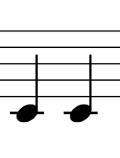

But the next example is also 1 beat in duration:

```Io
"0"
```
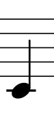

Few notes on the same beat share the beat proportionally:

```Io
"00 0"
```

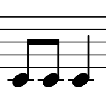

Also you can make such groups using parenthesis. All the notes inside the parenthesis correspond the same beat:

```Io
"(00 0) 0"
```
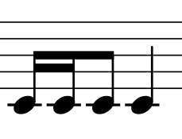

```Io
"00(00)0 r"
```
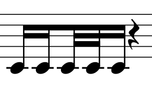

The above pattern can also be written as:

```Io
"(0 0 (0 0) 0) r"
```

There are methods for rhythmic constructions:

* `+` is a tie. A note will be concatenated with another, if the last one has this sign in place of a pitch;
* `.` makes a dot. Prolongs a note's duration for a half of its size;
* `*` increases a note's or group's duration exponentially (i.e. doubles duration);
* `:` decreases a note's or group's duration exponentially.

#### Examples:

```Io
"0 + + 0" // (0 + 0 + 0) 0
```
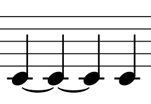

```Io
"0.0"
```
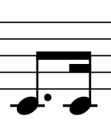

```Io
"0++0"
```
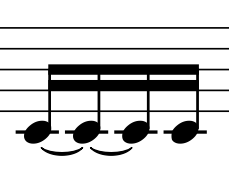

```Io
"0. 0: 0"
```
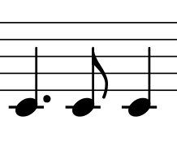

```Io
"0:0."
```
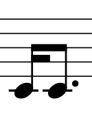

```Io
"0. 0. 0."
```
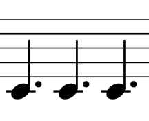

```Io
"0**" // 1/4 * 2 * 2
```
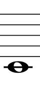

Also you can "chain" rhythmic methods:
```Io
"0*. 0"
```
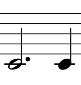

And apply them to parenthesised groups:
```Io
"(00 0)**"
```
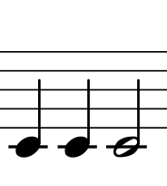

## Chords
All the first-order beats inside of square brackets will play on one beat.
```Io
"[0 4 7]"
```
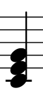

Rhythmic rules also work here:
```Io
"[0 4 7b]"
```
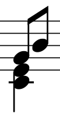

```Io
"[0 4 (7b 7)]"
```
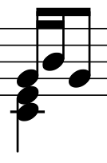

## <a name="octave"></a>Octave Transposition
To change octave put the value between `o`s in place, where you want transposition have to be happen. The value is a number of octaves to which you want to transpose.
A positive number will transpose up, a negative one — down.

```Io
"o1o 234 o-1o 210"
```
In C-major scale (G clef) will be:

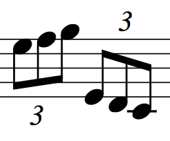

## Alterations
To alter a pitch put a floating point number between two `#` before the pitch, which you want to alter.
The number is a number of steps to alter. A positive one will alter up, a negative one — down. 

In C-major scale (G clef):
```Io
"#-1# 5 6"
```
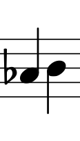

Microchromatic alterations are also possible.
```Io
"2#0.5#3"
```
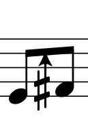

